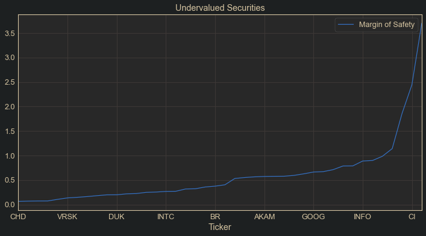
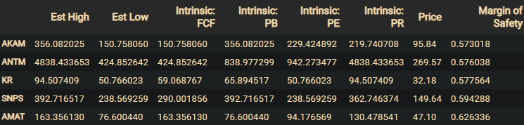

# TDA Scraper for Value Investors

## Summary
Contained in this repository is a web-scraping package for getting in-depth fundamentals information from TD Ameritrade's website. The main purpose of the package is to scrape a database of stock fundamentals information based on a list of tickers, then calculate a range of intrinsic value estimates for each stock, using a variety of growth metrics for projection, then finding all of the stocks which are currently trading above/below the calculated range, and determining the margins of safety for each based on these calculations. From this information, value investors may make educated decisions based on wide-scale comparisons of intrinsic value comparisons on a scale which can't be done by hand. There are likely ways to pay for such data convenience, but this package is designed for entry-level traders who want to learn as much as possible with minimum upfront investment. 

The database generated by the scraper is pretty comprehensive, so it could be very useful for other types of investigations involving modeling, especially if combined with time-series data after the database of fundamentals and valuation ratios is made. When you run the function build_big_df() after the scrape, it will stack all of the combined.csv files for each ticker passed horizontally, giving an index of tickers with 99-102 columns of data for each (depending on the time of day you scrape, there may or may not be 'Ask close', 'Bid close', and 'Last Trade' features, these only appear on the page after market close each day, and only on certain stocks, so they should usually be dropped). The analyst ratings are dated, so that you can avoid look-ahead bias with them, and you can also filter watchlists based on recent ratings. For each company there is also yearly earnings and financial statement information that can be looked at individually. 
If you have your own methods of calculating intrinsic value, add them to the calculate_intrinsic() function. 

Important Note: Before running a scrape, but after staring the bot, search a ticker and make sure that "Annual" is selected for both earnings and fundamentals on your account, or else the web scraper will not work properly. It is not designed to gather the quarterly earings or fundamentals, although it could be modified to do so if desired. The annual information is more revealing of long-term strength.
 
 

Example of output for a watchlist's margins of safety: 

 

Example output dataframe of intrinsic value estimates: 

 

Disclaimer: This package is meant to aid investors in their decision making, but the actions made by any individual as a result of their use of this package is completely at their own risk, and this package is not intended as investment advice. You should have a basic knowledge of value investing before using this package. TD Ameritrade offers comprehensive educational material to those who have an account for free, a great resource for anyone trying to build their fundamental trading knowledge.
 
 
## Getting Started
The scraper requires login information for TD Ameritrade, which can be passed in as a dictionary into the start_bot() function. The keys of the dictionary must be "user" and "pass". There is a function get_keys() that will retrieve this information from a .json file located on your computer which is recommended to protect your information from being exposed in your python file. 
 
This scraper also uses the TD Ameritrade API, so you will need an account at developer.tdameritrade.com in order to use it. It is used to get the most recent price, fundamentals, and market information used in the calculations. It is possible to modify the code to use only the information gathered by the webscraper, but that will be left up to the user. Making a developer account would be much easier. 
 
This scraper uses Alexander Golec's [python wrapper](https://github.com/alexgolec/tda-api) for the TD Ameritrade API. The author highly recommends doing your own research on the code, which is lightweight and easy to read, to assure that there are no security issues for your credentials, as you are using this code at your own risk. 
 
Selenium webdriver uses ChromeDriver to run the scraping operation, and ChromeDriver must be in your PATH. You will find the other dependencies listed below. 
 

#### Directions:
1. Clone this repo
2. Download/check dependencies:
    - bs4
    - numpy
    - pandas
    - selenium
    - [tda](https://github.com/alexgolec/tda-api) (the python wrapper for API)
    - matplotlib
3. Run the notebooks: 1) watchlist_scraping, then 2) data_exploration

 
Note that it is recommended that you create two .json files on your computer: one for your TD Ameritrade login credentials, and another for your API key, to be loaded from the get_keys() function. Loading the .json files is demonstrated in the notebooks. You can also just put this info into dictionaries within your script, but this is less safe for your info as someone might see your code at some point. 
 

## How to use

The proper workflow for this package can be followed by starting with the watchlist_scraping.ipynb, then continuing to the data_exploration.ipynb. 
 
Because the scraper must load the javascript on each page to get the information, it is not fast. The recommended use is to scrape a large watchlist (the SP500, for example) once a week after weekly market close (some time Friday night or over the weekend), then use the data obtained to create strategies for the upcoming trading week.  
 
Scraping the SP500 can take around 5 hours, and TD Ameritrade will try and log you out during the process, so unless you want to babysit, you will need to log on to your account and go to Client Service -> My Profile -> General and adjust Timeout Settings in the Web Site section of the page to change your settings. It is also recommended that you turn any power-saving options off (display and sleep settings) on your computer before running the scraper, as these will interfere with the process. 
 
The scraper will log any issues it comes across, as well as return a list of any securities it skipped. Further, the scrape_watchlist() function can be told to ignore finished securities within the database directory in the event of an interrupt, so that you do not need to start all over again if something does go wrong. 
 
The files are stored in a dated directory on the user's computer in the form of .csv files so they are easy to modify to your heart's extent once you get the data in. 
 
Happy trading! 
 
S. Nathaniel Cibik 2020